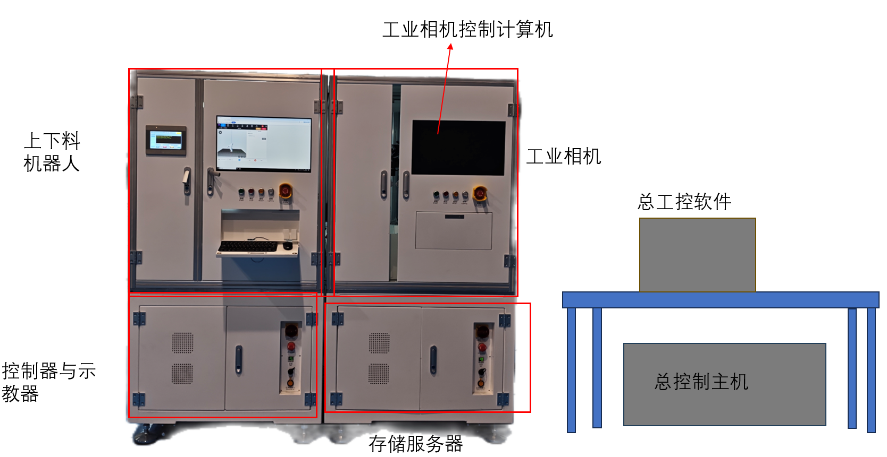
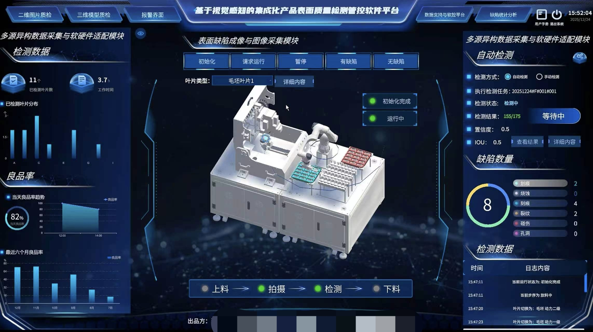
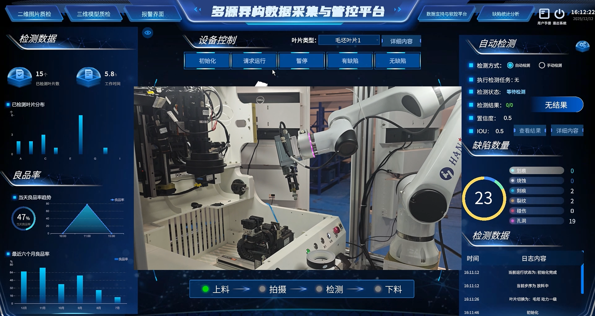
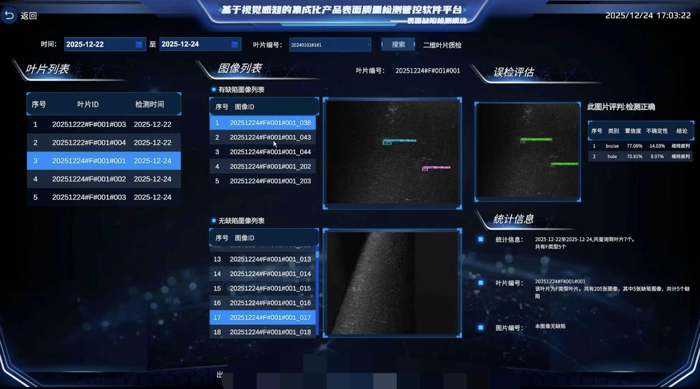
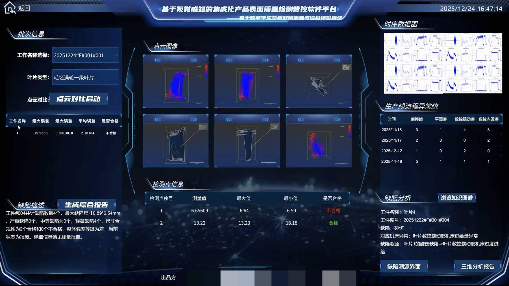
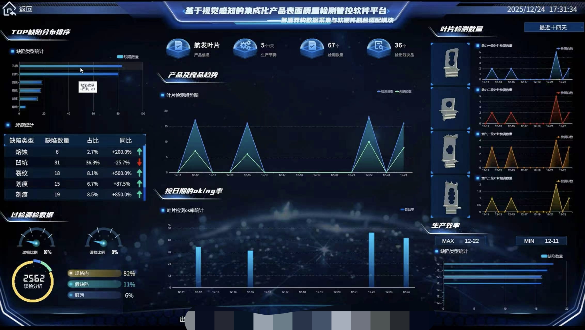

#  航发叶片智能缺陷检测与质量管控系统

**Aero-Engine Blade Intelligent Defect Detection & Quality Control System**

---

## 📖 项目简介

本系统是一套**软硬件一体化的航空发动机叶片表面质量检测平台**，集成了：
- ✅ **2D/3D 视觉检测**（改进 YOLO 算法）
- ✅ **Unity3D 数字孪生监控**
- ✅ **自动化机械臂上下料**
- ✅ **MySQL 多源数据管理**
- ✅ **TCP/IP 工业通信**

实现了从自动上料→图像采集→缺陷检测→数据分析→自动下料的**全流程自动化**。

---

## 🏗️ 硬件系统架构

**核心组件：**
- 工业相机控制计算机（2000万像素）
- 六轴机械臂（上下料机器人）
- PLC 控制器与示教器
- 存储服务器
- 总控制主机与工控软件

---

## 💻 软件界面展示

### 1️⃣ 数字孪生监控主界面

*Unity3D 实时映射物理产线，显示设备状态、控制设备上下料流程、良品率趋势、缺陷统计*

---

### 2️⃣ 设备控制与实时监控

*真实机械臂作业画面 + 自动化流程控制（上料→拍摄→检测→下料）*

---

### 3️ 在线检测与模型推理

*检测前后对比 + 缺陷描述（类型、置信度、坐标）+ 事件日志*

---

### 4️⃣ 历史数据查询与人工复核

*多维度检索 + 误检评估 + 统计信息*

---

### 5️ 3D点云分析界面

*点云对比 + 误差分析 + 缺陷溯源 + 生产线异常统计*

---

### 6️⃣ 数据统计与分析大屏

*TOP缺陷分布 + 良品率趋势 + 生产效率分析 + 过检漏检统计*

---

##  核心技术栈

| 模块 | 技术 |
|------|------|
| **上位机** | Unity3D + C# |
| **AI算法** | Python + PyTorch + YOLOv8 |
| **数据库** | MySQL 8.0 |
| **通信** | TCP/IP + Modbus TCP |
| **硬件** | 工业相机 + 六轴机械臂 + PLC |

---

##  技术指标

- **检测精度**: mAP@0.5 = 96.8%
- **检测速度**: ≤ 2秒/张
- **产线节拍**: ≤ 30秒/件
- **缺陷类型**: 划痕、裂纹、凹坑、熔蚀、刻痕、孔洞
- **良品率**: 82% - 97%

---

##  核心功能

1. **多模态检测**: 2D表面缺陷 + 3D形貌误差
2. **自动化产线**: 机械臂自动上下料，无需人工干预
3. **数字生**: Unity3D 实时监控物理产线
4. **缺陷溯源**: 从检测结果反向追溯机床异常
5. **数据管理**: 100%检测数据存档，支持质量追溯

---

## 📁 项目文件说明
